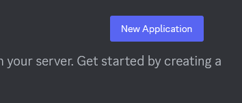
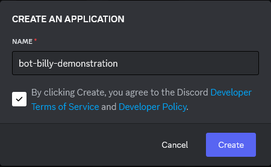
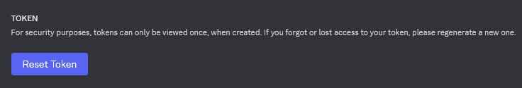
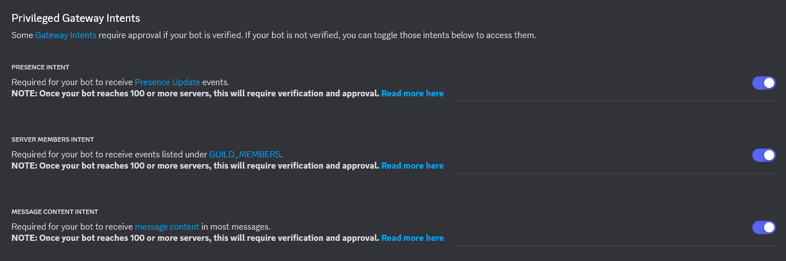

# How To: Make your own Bot Bilby
1. Go to the [Discord Developer Portal](https://discord.com/developers/applications) and create a `New Application` (there should be a button on the top-right corner).
 - 

2. Name the application however you want (just, don't name it Bot Bilby, cause that has been copyrighted by us (jk)).
- 

3. Go into the `Bot` tab (should be on the panel to the left of your screen).
4. There should be a button under the `Token` section called: `Reset Token`. Click it to get a new token for your bot. Discord then may ask you to authenticate using your password or 2FA. After authenticating, you'll be granted a new token. **Note down the token, and DO NOT LOSE THIS OR SHARE PUBLICLY WITH ANY OTHER PEOPLE**.
- 
5. Under that, you should see a `Privileged Gateway Intents` section. Turn on all three of the intents, since the bot will require the use of all three of them.
- 
6. Finally, time to invite the bot! Copy the following URL into the browser, replacing the `<client_id>` with the client ID of the app you just created.
```
https://discord.com/oauth2/authorize?client_id=<client_id>&permissions=28031845788738&integration_type=0&scope=bot+applications.commands
```