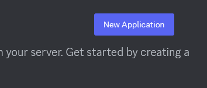
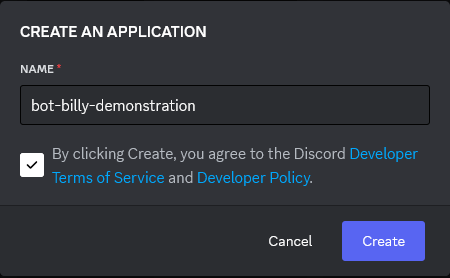
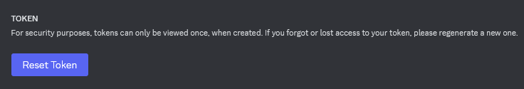
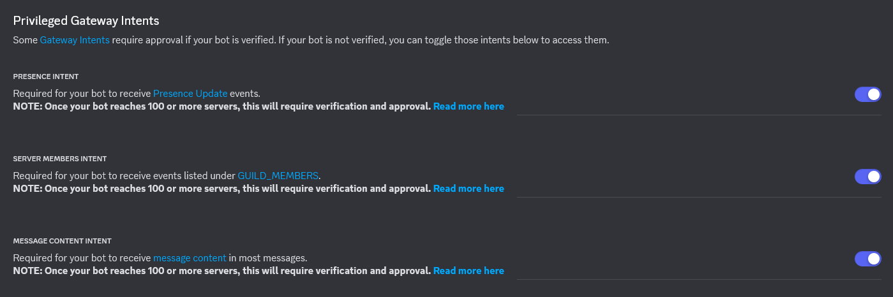
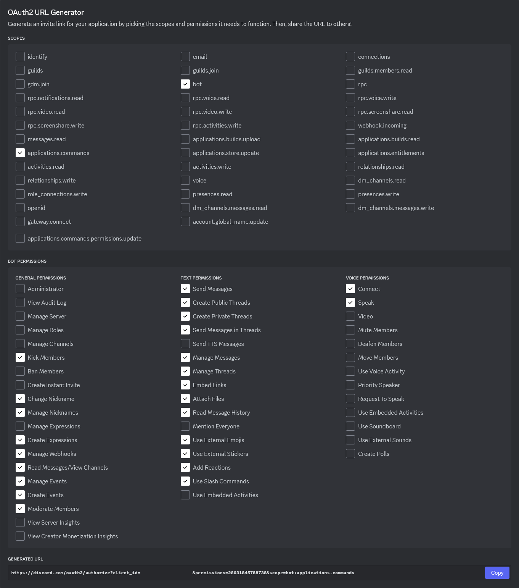

# How To: Make your own Bot Billy
1. Go to the [Discord Developer Portal](https://discord.com/developers/applications) and create a `New Application` (there should be a button on the top-right corner).
 - 

2. Name the application however you want (just, don't name it Bot Billy, cause that has been copyrighted by us (jk)).
- 

3. Go into the `Bot` tab (should be on the panel to the left of your screen).
4. There should be a button under the `Token` section called: `Reset Token`. Click it to get a new token for your bot. Discord then may ask you to authenticate using your password or 2FA. After authenticating, you'll be granted a new token. **Note down the token, and DO NOT LOSE THIS OR SHARE PUBLICLY WITH ANY OTHER PEOPLE**.
- 
5. Under that, you should see a `Privileged Gateway Intents` section. Turn on all three of the intents, since the bot will require the use of all three of them.
- 
6. Finally, let's make sure the bot have the appropriate permission. In the `OAuth2` tab, scroll down and you should see a `OAuth2 URL Generator`. Ensure that all of the following box are checked.
- 
7. Once done, a URL should appear below. Copy that, and now you have the URL to invite the bot to the server! (Incase you are wondering what is the Permission Integer, it's `28031845788738`)